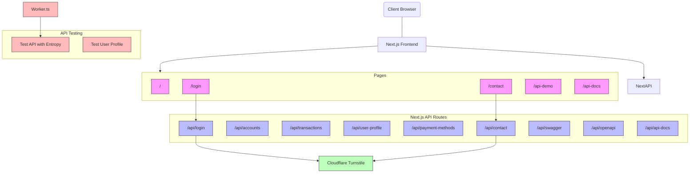
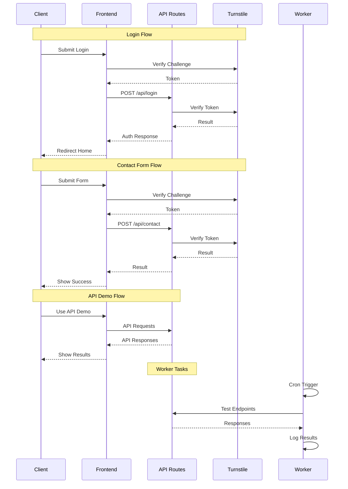
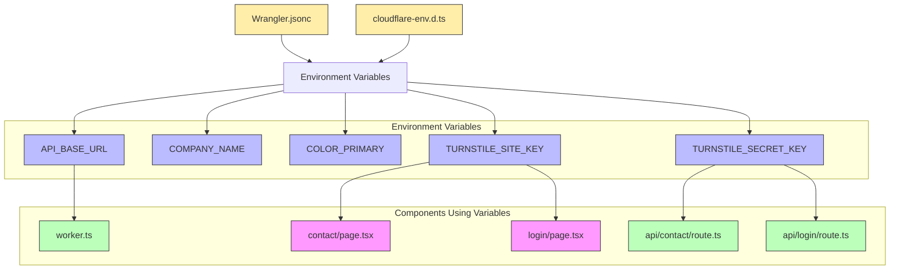

# Project Architecture

Below is a visual representation of the architecture of the Banking API Demo project using mermaid diagrams designed for portrait mode.

## High-Level Architecture

## Component Structure

```mermaid
graph TB
    App[App Layout]
    
    subgraph "Frontend Components"
        direction TB
        LoginComponent[Login Component]
        ContactComponent[Contact Component]
        APIDemo[API Demo Component]
        HomePage[Home Page Component]
        APIDocsPage[API Docs Component]
    end
    
    App --> LoginComponent
    App --> ContactComponent
    App --> APIDemo
    App --> HomePage
    App --> APIDocsPage
    
    subgraph "Configuration"
        direction TB
        WranglerConfig[Wrangler Config]
        EnvironmentVars[Environment Variables]
        CloudflareEnv[CloudflareEnv Interface]
    end
    
    WranglerConfig --> EnvironmentVars
    EnvironmentVars --> CloudflareEnv
    
    subgraph "API Handlers"
        direction TB
        LoginHandler[Login Handler]
        ContactHandler[Contact Handler]
        AccountsHandler[Accounts Handler]
        TransactionsHandler[Transactions Handler]
        UserProfileHandler[User Profile Handler]
        PaymentMethodsHandler[Payment Methods Handler]
        SwaggerHandler[Swagger Handler]
        OpenAPIHandler[OpenAPI Handler]
        APIDocsHandler[API Docs Handler]
    end
    
    ContactComponent --> Turnstile
    LoginComponent --> Turnstile
    
    ContactComponent --> ContactHandler
    LoginComponent --> LoginHandler
    
    Turnstile[Cloudflare Turnstile]
    
    APIDemo --> API[API Endpoints]
    API --> LoginHandler
    API --> ContactHandler
    API --> AccountsHandler
    API --> TransactionsHandler
    API --> UserProfileHandler
    API --> PaymentMethodsHandler
    
    subgraph "Worker"
        direction TB
        WorkerHandler[Worker Handler]
        ScheduledTasks[Scheduled Tasks]
    end
    
    WranglerConfig --> WorkerHandler
    WorkerHandler --> ScheduledTasks
    ScheduledTasks --> APITest[API Testing]
    
    classDef component fill:#f9f,stroke:#333,stroke-width:1px;
    classDef config fill:#fea,stroke:#333,stroke-width:1px;
    classDef handler fill:#bbf,stroke:#333,stroke-width:1px;
    classDef worker fill:#fbb,stroke:#333,stroke-width:1px;
    classDef service fill:#bfb,stroke:#333,stroke-width:1px;
    
    class App,LoginComponent,ContactComponent,APIDemo,HomePage,APIDocsPage component;
    class WranglerConfig,EnvironmentVars,CloudflareEnv config;
    class LoginHandler,AccountsHandler,TransactionsHandler,UserProfileHandler,PaymentMethodsHandler,ContactHandler,SwaggerHandler,OpenAPIHandler,APIDocsHandler handler;
    class WorkerHandler,ScheduledTasks,APITest worker;
    class Turnstile service;
```

## Data Flow

## Environment Configuration

