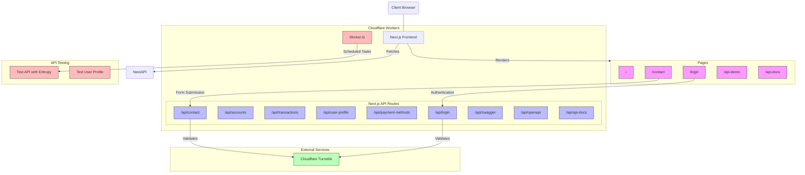
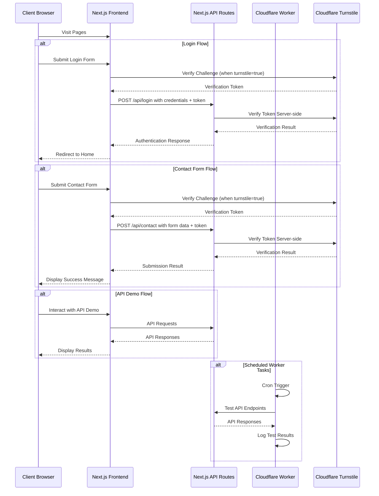

# Project Architecture

Below is a visual representation of the architecture of the Banking API Demo project using mermaid diagrams.

## High-Level Architecture



## Component Structure

```mermaid
graph TD
    subgraph "Frontend Components"
        App[App Layout]
        LoginComponent[Login Component]
        ContactComponent[Contact Component]
        APIDemo[API Demo Component]
        HomePage[Home Page Component]
        APIDocsPage[API Docs Component]
    end
    
    subgraph "Configuration"
        WranglerConfig[Wrangler Config]
        EnvironmentVars[Environment Variables]
        CloudflareEnv[CloudflareEnv Interface]
    end
    
    subgraph "API Handlers"
        LoginHandler[Login Handler]
        AccountsHandler[Accounts Handler]
        TransactionsHandler[Transactions Handler]
        UserProfileHandler[User Profile Handler]
        PaymentMethodsHandler[Payment Methods Handler]
        ContactHandler[Contact Handler]
        SwaggerHandler[Swagger Handler]
        OpenAPIHandler[OpenAPI Handler]
        APIDocsHandler[API Docs Handler]
    end
    
    WranglerConfig -->|Defines| EnvironmentVars
    EnvironmentVars -->|Types Defined in| CloudflareEnv
    
    ContactComponent -->|Uses| Turnstile
    LoginComponent -->|Uses| Turnstile
    
    ContactComponent -->|Submits to| ContactHandler
    LoginComponent -->|Authenticates via| LoginHandler
    
    Turnstile[Cloudflare Turnstile]
    
    APIDemo -->|Interacts with| API
    
    subgraph "Worker"
        WorkerHandler[Worker Handler]
        ScheduledTasks[Scheduled Tasks]
        APITest[API Testing]
    end
    
    WranglerConfig -->|Configures| WorkerHandler
    WorkerHandler -->|Executes| ScheduledTasks
    ScheduledTasks -->|Runs| APITest
    
    classDef component fill:#f9f,stroke:#333,stroke-width:1px;
    classDef config fill:#fea,stroke:#333,stroke-width:1px;
    classDef handler fill:#bbf,stroke:#333,stroke-width:1px;
    classDef worker fill:#fbb,stroke:#333,stroke-width:1px;
    classDef service fill:#bfb,stroke:#333,stroke-width:1px;
    
    class App,LoginComponent,ContactComponent,APIDemo,HomePage,APIDocsPage component;
    class WranglerConfig,EnvironmentVars,CloudflareEnv config;
    class LoginHandler,AccountsHandler,TransactionsHandler,UserProfileHandler,PaymentMethodsHandler,ContactHandler,SwaggerHandler,OpenAPIHandler,APIDocsHandler handler;
    class WorkerHandler,ScheduledTasks,APITest worker;
    class Turnstile service;
```



## Data Flow



## Environment Configuration

```mermaid
graph TD
    WranglerConfig[Wrangler.jsonc] -->|Defines| EnvVars[Environment Variables]
    
    EnvVars -->|Referenced by| WorkerTS[worker.ts]
    EnvVars -->|Referenced by| ContactPage[contact/page.tsx]
    EnvVars -->|Referenced by| LoginPage[login/page.tsx]
    EnvVars -->|Referenced by| ContactAPI[api/contact/route.ts]
    EnvVars -->|Referenced by| LoginAPI[api/login/route.ts]
    
    subgraph "Environment Variables"
        APIURL[API_BASE_URL]
        CompanyName[COMPANY_NAME]
        PrimaryColor[COLOR_PRIMARY]
        TurnstileSiteKey[TURNSTILE_SITE_KEY]
        TurnstileSecretKey[TURNSTILE_SECRET_KEY]
    end
    
    TurnstileSiteKey -->|Used in| ContactPage
    TurnstileSiteKey -->|Used in| LoginPage
    TurnstileSecretKey -->|Used in| ContactAPI
    TurnstileSecretKey -->|Used in| LoginAPI
    APIURL -->|Used in| WorkerTS
    
    CloudflareEnvTS[cloudflare-env.d.ts] -->|Defines types for| EnvVars
    
    classDef config fill:#fea,stroke:#333,stroke-width:1px;
    classDef var fill:#bbf,stroke:#333,stroke-width:1px;
    classDef component fill:#f9f,stroke:#333,stroke-width:1px;
    classDef api fill:#bfb,stroke:#333,stroke-width:1px;
    
    class WranglerConfig,CloudflareEnvTS config;
    class APIURL,CompanyName,PrimaryColor,TurnstileSiteKey,TurnstileSecretKey var;
    class ContactPage,LoginPage component;
    class ContactAPI,LoginAPI,WorkerTS api;
